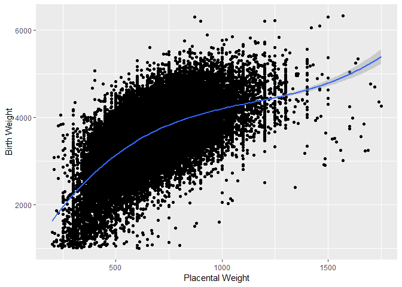

``` r
library(ggplot2)
library(glm2)
library(mgcv)
```

``` r
load(file="C:/Users/cjfla/Desktop/v10/r_data/2018_02_01_PDB315_MFR_520_v10.RData")
```

First subset the daa to exclude extreme outliers.

``` r
mfr1<-subset(mfr, PLACENTAVEKT<2000 & PLACENTAVEKT>200 & VEKT>1000 & (KJONN=="Boy"|KJONN=="Girl"), select=c(PLACENTAVEKT,VEKT,SVLEN, SVLEN.UL.DG, SVLEN.SM.DG, FAAR, HELSEREGION, KJONN))
```

Fit a generaised linear model to this data and plot the regression line.

``` r
mfr1[1:2] <- lapply(mfr1[1:2], as.numeric)
fit1 <- glm(VEKT ~ PLACENTAVEKT, data=mfr1,
family = gaussian(link="identity"))
summary(fit1)
```

    ## 
    ## Call:
    ## glm(formula = VEKT ~ PLACENTAVEKT, family = gaussian(link = "identity"), 
    ##     data = mfr1)
    ## 
    ## Deviance Residuals: 
    ##     Min       1Q   Median       3Q      Max  
    ## -3845.8   -243.5     44.7    319.8   2445.8  
    ## 
    ## Coefficients:
    ##               Estimate Std. Error t value Pr(>|t|)    
    ## (Intercept)  2.504e+03  6.770e+00   370.0   <2e-16 ***
    ## PLACENTAVEKT 1.551e+00  9.595e-03   161.7   <2e-16 ***
    ## ---
    ## Signif. codes:  0 '***' 0.001 '**' 0.01 '*' 0.05 '.' 0.1 ' ' 1
    ## 
    ## (Dispersion parameter for gaussian family taken to be 272036.1)
    ## 
    ##     Null deviance: 3.7100e+10  on 110231  degrees of freedom
    ## Residual deviance: 2.9987e+10  on 110230  degrees of freedom
    ## AIC: 1692238
    ## 
    ## Number of Fisher Scoring iterations: 2

``` r
ggplot(mfr1, aes(x=PLACENTAVEKT, y=VEKT))+ geom_point() +
  ylab("Birth Weight") + xlab("Placental Weight") +
  stat_smooth(method='lm',
              formula = y ~ x)
```


Reduce the dataset to include only singletons.

Again fit a GLM and plot the regression.

``` r
mfr2<-subset(mfr, PLACENTAVEKT<2000 & PLACENTAVEKT>200 & VEKT>1000 & (KJONN=="Boy"|KJONN=="Girl")
             & FLERFODSEL=="Single birth", select=c(PLACENTAVEKT,VEKT,SVLEN, SVLEN.UL.DG, SVLEN.SM.DG, FAAR, HELSEREGION, KJONN))
```

``` r
mfr2[1:2] <- lapply(mfr2[1:2], as.numeric)
fit2 <- glm(VEKT ~ PLACENTAVEKT, data=mfr2,
family = gaussian(link="identity"))
summary(fit2)
```

    ## 
    ## Call:
    ## glm(formula = VEKT ~ PLACENTAVEKT, family = gaussian(link = "identity"), 
    ##     data = mfr2)
    ## 
    ## Deviance Residuals: 
    ##     Min       1Q   Median       3Q      Max  
    ## -4576.6   -255.7     13.7    274.5   2250.9  
    ## 
    ## Coefficients:
    ##               Estimate Std. Error t value Pr(>|t|)    
    ## (Intercept)  2.042e+03  6.165e+00   331.3   <2e-16 ***
    ## PLACENTAVEKT 2.306e+00  8.897e-03   259.2   <2e-16 ***
    ## ---
    ## Signif. codes:  0 '***' 0.001 '**' 0.01 '*' 0.05 '.' 0.1 ' ' 1
    ## 
    ## (Dispersion parameter for gaussian family taken to be 184635.6)
    ## 
    ##     Null deviance: 3.2077e+10  on 106533  degrees of freedom
    ## Residual deviance: 1.9670e+10  on 106532  degrees of freedom
    ## AIC: 1594181
    ## 
    ## Number of Fisher Scoring iterations: 2

``` r
ggplot(mfr2, aes(x=PLACENTAVEKT, y=VEKT))+ geom_point() + 
  ylab("Birth Weight") + xlab("Placental Weight") +
  stat_smooth(method='lm',
             formula = y ~ x )
```


The multiple births appear to be a different relationship then that of singletons. The birth weight is much lower even when the placental weight is reasonably high.

There are still a few outliers within the dataset and I remove these to visualise their leverage on the regression.

``` r
mfr3<-mfr2[(mfr2$PLACENTAVEKT<1500|mfr2$VEKT>2200),]
```

``` r
mfr4<-mfr3[(mfr3$PLACENTAVEKT<1700|mfr3$VEKT>4000),]
```

Fit a GLm and plot the regression.

``` r
mfr4[1:2] <- lapply(mfr4[1:2], as.numeric)
fit4 <- glm(VEKT ~ PLACENTAVEKT, data=mfr4,
family = gaussian(link="identity"))
summary(fit4)
```

    ## 
    ## Call:
    ## glm(formula = VEKT ~ PLACENTAVEKT, family = gaussian(link = "identity"), 
    ##     data = mfr4)
    ## 
    ## Deviance Residuals: 
    ##      Min        1Q    Median        3Q       Max  
    ## -2818.96   -255.79     13.67    274.74   2248.93  
    ## 
    ## Coefficients:
    ##               Estimate Std. Error t value Pr(>|t|)    
    ## (Intercept)  2.036e+03  6.161e+00   330.5   <2e-16 ***
    ## PLACENTAVEKT 2.316e+00  8.893e-03   260.4   <2e-16 ***
    ## ---
    ## Signif. codes:  0 '***' 0.001 '**' 0.01 '*' 0.05 '.' 0.1 ' ' 1
    ## 
    ## (Dispersion parameter for gaussian family taken to be 183926.6)
    ## 
    ##     Null deviance: 3.2065e+10  on 106527  degrees of freedom
    ## Residual deviance: 1.9593e+10  on 106526  degrees of freedom
    ## AIC: 1593681
    ## 
    ## Number of Fisher Scoring iterations: 2

``` r
ggplot(mfr3, aes(x=PLACENTAVEKT, y=VEKT))+ geom_point() +
  ylab("Birth Weight") + xlab("Placental Weight") +
  stat_smooth(method='lm',
               formula = y ~ x )
```


The outliers didn't seem to exert much leverage on the regression but the relationship between placental weight and birth weight isn't linear and the non-linear relationship needs to be explored.

I used generalised additive models to look at the non0linear relationship.

The first GAM model employed a cubic spline smoothing funtion.

``` r
mfr4[1:2] <- lapply(mfr4[1:2], as.numeric)
gam1 <- gam(VEKT ~ s(PLACENTAVEKT, bs="cs", k=6),
           family=gaussian,data=mfr4)
summary(gam1)
```

    ## 
    ## Family: gaussian 
    ## Link function: identity 
    ## 
    ## Formula:
    ## VEKT ~ s(PLACENTAVEKT, bs = "cs", k = 6)
    ## 
    ## Parametric coefficients:
    ##             Estimate Std. Error t value Pr(>|t|)    
    ## (Intercept) 3603.818      1.284    2808   <2e-16 ***
    ## ---
    ## Signif. codes:  0 '***' 0.001 '**' 0.01 '*' 0.05 '.' 0.1 ' ' 1
    ## 
    ## Approximate significance of smooth terms:
    ##                   edf Ref.df     F p-value    
    ## s(PLACENTAVEKT) 4.985      5 15235  <2e-16 ***
    ## ---
    ## Signif. codes:  0 '***' 0.001 '**' 0.01 '*' 0.05 '.' 0.1 ' ' 1
    ## 
    ## R-sq.(adj) =  0.417   Deviance explained = 41.7%
    ## GCV = 1.7551e+05  Scale est. = 1.755e+05  n = 106528

``` r
ggplot(mfr4, aes(x = PLACENTAVEKT, y = VEKT)) + geom_point() + xlab("Placental Weight") + ylab("Birth Weight") +
  (geom_smooth(method="gam",formula=y ~ s(x, bs = "cs", k=6))) 
```


The second GAM model I employed a penalised spline as a smoothing function.

``` r
mfr4[1:2] <- lapply(mfr4[1:2], as.numeric)
gam2 <- gam(VEKT ~ s(PLACENTAVEKT, bs="ps", k=4),
           family=gaussian,data=mfr4)
summary(gam2)
```

    ## 
    ## Family: gaussian 
    ## Link function: identity 
    ## 
    ## Formula:
    ## VEKT ~ s(PLACENTAVEKT, bs = "ps", k = 4)
    ## 
    ## Parametric coefficients:
    ##             Estimate Std. Error t value Pr(>|t|)    
    ## (Intercept) 3603.818      1.286    2803   <2e-16 ***
    ## ---
    ## Signif. codes:  0 '***' 0.001 '**' 0.01 '*' 0.05 '.' 0.1 ' ' 1
    ## 
    ## Approximate significance of smooth terms:
    ##                   edf Ref.df     F p-value    
    ## s(PLACENTAVEKT) 2.999      3 25179  <2e-16 ***
    ## ---
    ## Signif. codes:  0 '***' 0.001 '**' 0.01 '*' 0.05 '.' 0.1 ' ' 1
    ## 
    ## R-sq.(adj) =  0.415   Deviance explained = 41.5%
    ## GCV = 1.7613e+05  Scale est. = 1.7612e+05  n = 106528

``` r
p<-ggplot(mfr4, aes(x = PLACENTAVEKT, y = VEKT)) + geom_point() + xlab("Placental Weight") + ylab("Birth Weight")
p + stat_smooth(method = "gam", formula = y ~ s(x, bs="ps", k = 4), size = 1)
```



AIC(fit4, gam1, gam2)

According to the AIC the second GAM model with the penalised spline fits the data slightly better but there is no real difference. Visually I think the cubic splines fit better as the penalised smoothing suggest an increase in the association in the higher placental weight. At the moment though, I think this is just due to noise and more work with smoothing functions will improve the models.

\*\*Please note the investigations on the regresion models are not complete and need further work once the finalised dataset is being analysed.

Furthermore, both birth weight and placental weight need to be adjusted for gestational age which I am currently working on.

I will send these adjusted models through asap.
