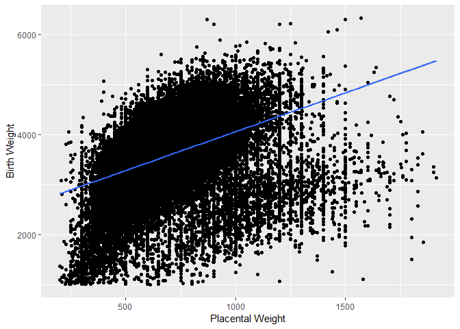
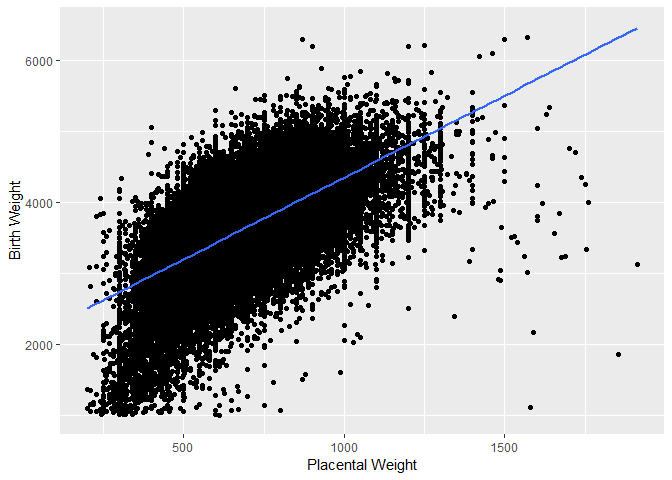
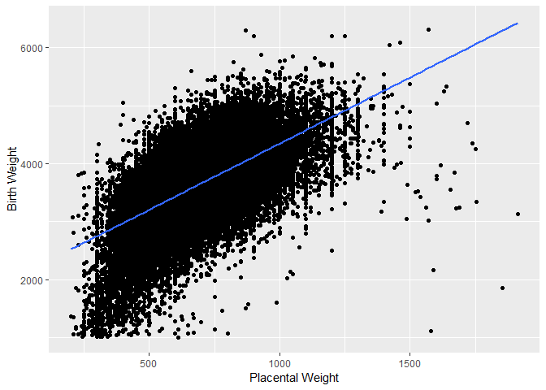
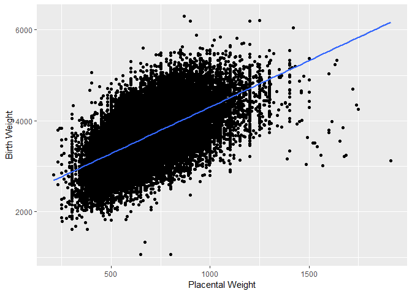
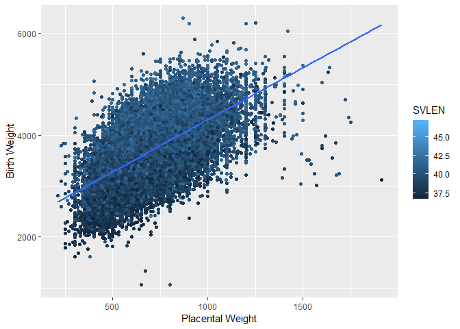
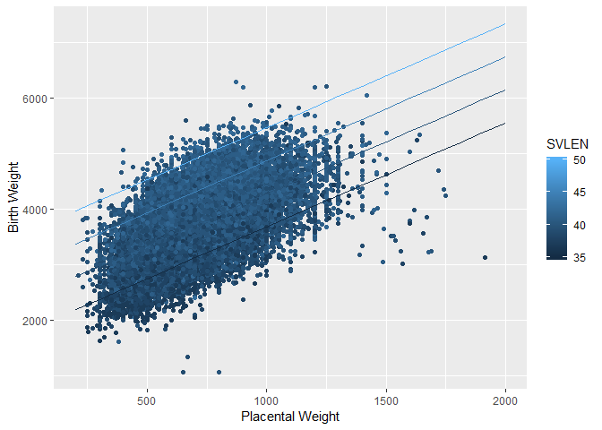
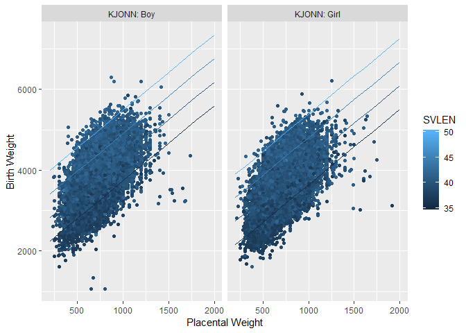

``` r
library(ggplot2)
library(glm2)
library(mgcv)
library(dplyr)
```

``` r
load(file="C:/Users/cjfla/Desktop/v10/r_data/2018_02_01_PDB315_MFR_520_v10.RData")
```

First subset the daa to exclude extreme outliers and unknown fetal gender.

``` r
mfr1<-subset(mfr, PLACENTAVEKT<2000 & PLACENTAVEKT>200 & VEKT>1000 & (KJONN=="Boy"|KJONN=="Girl"), select=c(PLACENTAVEKT,VEKT,SVLEN, SVLEN.DG, FAAR, HELSEREGION, KJONN, FLERFODSEL, ROBSON.10, MISD, MORS.ALDER.KAT.K8))
```

Fit a generaised linear model to this data and plot the regression line.

``` r
mfr1[1:2] <- lapply(mfr1[1:2], as.numeric)
fit1 <- glm(VEKT ~ PLACENTAVEKT, data=mfr1,
family = gaussian(link="identity"))
summary(fit1)
```

    ## 
    ## Call:
    ## glm(formula = VEKT ~ PLACENTAVEKT, family = gaussian(link = "identity"), 
    ##     data = mfr1)
    ## 
    ## Deviance Residuals: 
    ##     Min       1Q   Median       3Q      Max  
    ## -3845.8   -243.5     44.7    319.8   2445.8  
    ## 
    ## Coefficients:
    ##               Estimate Std. Error t value Pr(>|t|)    
    ## (Intercept)  2.504e+03  6.770e+00   370.0   <2e-16 ***
    ## PLACENTAVEKT 1.551e+00  9.595e-03   161.7   <2e-16 ***
    ## ---
    ## Signif. codes:  0 '***' 0.001 '**' 0.01 '*' 0.05 '.' 0.1 ' ' 1
    ## 
    ## (Dispersion parameter for gaussian family taken to be 272036.1)
    ## 
    ##     Null deviance: 3.7100e+10  on 110231  degrees of freedom
    ## Residual deviance: 2.9987e+10  on 110230  degrees of freedom
    ## AIC: 1692238
    ## 
    ## Number of Fisher Scoring iterations: 2

``` r
ggplot(mfr1, aes(x=PLACENTAVEKT, y=VEKT))+ geom_point() +
  ylab("Birth Weight") + xlab("Placental Weight") +
  stat_smooth(method='lm',
              formula = y ~ x)
```



Reduce the dataset to include only singletons.

Again fit a GLM and plot the regression.

``` r
mfr2<-subset(mfr1, FLERFODSEL=="Single birth")
```

``` r
mfr2[1:2] <- lapply(mfr2[1:2], as.numeric)
fit2 <- glm(VEKT ~ PLACENTAVEKT, data=mfr2,
family = gaussian(link="identity"))
summary(fit2)
```

    ## 
    ## Call:
    ## glm(formula = VEKT ~ PLACENTAVEKT, family = gaussian(link = "identity"), 
    ##     data = mfr2)
    ## 
    ## Deviance Residuals: 
    ##     Min       1Q   Median       3Q      Max  
    ## -4576.6   -255.7     13.7    274.5   2250.9  
    ## 
    ## Coefficients:
    ##               Estimate Std. Error t value Pr(>|t|)    
    ## (Intercept)  2.042e+03  6.165e+00   331.3   <2e-16 ***
    ## PLACENTAVEKT 2.306e+00  8.897e-03   259.2   <2e-16 ***
    ## ---
    ## Signif. codes:  0 '***' 0.001 '**' 0.01 '*' 0.05 '.' 0.1 ' ' 1
    ## 
    ## (Dispersion parameter for gaussian family taken to be 184635.6)
    ## 
    ##     Null deviance: 3.2077e+10  on 106533  degrees of freedom
    ## Residual deviance: 1.9670e+10  on 106532  degrees of freedom
    ## AIC: 1594181
    ## 
    ## Number of Fisher Scoring iterations: 2

``` r
ggplot(mfr2, aes(x=PLACENTAVEKT, y=VEKT))+ geom_point() + 
  ylab("Birth Weight") + xlab("Placental Weight") +
  stat_smooth(method='lm',
             formula = y ~ x )
```



Next I will exclude babies with congenital abnormalities.

``` r
mfr3<-filter(mfr2, MISD!="Yes"|is.na(MISD))
```

``` r
mfr3[1:2] <- lapply(mfr3[1:2], as.numeric)
fit3 <- glm(VEKT ~ PLACENTAVEKT, data=mfr3,
family = gaussian(link="identity"))
summary(fit3)
```

    ## 
    ## Call:
    ## glm(formula = VEKT ~ PLACENTAVEKT, family = gaussian(link = "identity"), 
    ##     data = mfr3)
    ## 
    ## Deviance Residuals: 
    ##     Min       1Q   Median       3Q      Max  
    ## -4561.8   -254.7     11.9    272.2   2250.4  
    ## 
    ## Coefficients:
    ##               Estimate Std. Error t value Pr(>|t|)    
    ## (Intercept)  2.062e+03  6.280e+00   328.3   <2e-16 ***
    ## PLACENTAVEKT 2.285e+00  9.061e-03   252.2   <2e-16 ***
    ## ---
    ## Signif. codes:  0 '***' 0.001 '**' 0.01 '*' 0.05 '.' 0.1 ' ' 1
    ## 
    ## (Dispersion parameter for gaussian family taken to be 180428.2)
    ## 
    ##     Null deviance: 2.9793e+10  on 101540  degrees of freedom
    ## Residual deviance: 1.8320e+10  on 101539  degrees of freedom
    ## AIC: 1517125
    ## 
    ## Number of Fisher Scoring iterations: 2

``` r
ggplot(mfr3, aes(x=PLACENTAVEKT, y=VEKT))+ geom_point() + 
  ylab("Birth Weight") + xlab("Placental Weight") +
  stat_smooth(method='lm',
             formula = y ~ x )
```



Next I will remove preterm fetuses due to the higher prevalence of vascular abnormalities in this cohort that would affect the placenta and fetal growth.

``` r
mfr4<-filter(mfr3, SVLEN>=37)
```

``` r
mfr4[1:2] <- lapply(mfr4[1:2], as.numeric)
fit4 <- glm(VEKT ~ PLACENTAVEKT, data=mfr4,
family = gaussian(link="identity"))
summary(fit4)
```

    ## 
    ## Call:
    ## glm(formula = VEKT ~ PLACENTAVEKT, family = gaussian(link = "identity"), 
    ##     data = mfr4)
    ## 
    ## Deviance Residuals: 
    ##      Min        1Q    Median        3Q       Max  
    ## -3039.83   -255.19     -6.33    248.83   2260.03  
    ## 
    ## Coefficients:
    ##               Estimate Std. Error t value Pr(>|t|)    
    ## (Intercept)  2.262e+03  5.988e+00   377.7   <2e-16 ***
    ## PLACENTAVEKT 2.044e+00  8.582e-03   238.2   <2e-16 ***
    ## ---
    ## Signif. codes:  0 '***' 0.001 '**' 0.01 '*' 0.05 '.' 0.1 ' ' 1
    ## 
    ## (Dispersion parameter for gaussian family taken to be 148585.5)
    ## 
    ##     Null deviance: 2.2807e+10  on 96774  degrees of freedom
    ## Residual deviance: 1.4379e+10  on 96773  degrees of freedom
    ## AIC: 1427125
    ## 
    ## Number of Fisher Scoring iterations: 2

``` r
ggplot(mfr4, aes(x=PLACENTAVEKT, y=VEKT))+ geom_point() + 
  ylab("Birth Weight") + xlab("Placental Weight") +
  stat_smooth(method='lm',
             formula = y ~ x )
```



Due to the confounding affect of gestational age I will adjust for it in the regression.

``` r
mfr4[1:4] <- lapply(mfr4[1:4], as.numeric)
fit4 <- glm(VEKT ~ PLACENTAVEKT + SVLEN, data=mfr4,
family = gaussian(link="identity"))
summary(fit4)
```

    ## 
    ## Call:
    ## glm(formula = VEKT ~ PLACENTAVEKT + SVLEN, family = gaussian(link = "identity"), 
    ##     data = mfr4)
    ## 
    ## Deviance Residuals: 
    ##      Min        1Q    Median        3Q       Max  
    ## -2835.12   -234.71     -6.49    228.27   2075.70  
    ## 
    ## Coefficients:
    ##                Estimate Std. Error t value Pr(>|t|)    
    ## (Intercept)  -2.344e+03  3.556e+01   -65.9   <2e-16 ***
    ## PLACENTAVEKT  1.872e+00  8.017e-03   233.5   <2e-16 ***
    ## SVLEN         1.188e+02  9.061e-01   131.1   <2e-16 ***
    ## ---
    ## Signif. codes:  0 '***' 0.001 '**' 0.01 '*' 0.05 '.' 0.1 ' ' 1
    ## 
    ## (Dispersion parameter for gaussian family taken to be 126179.2)
    ## 
    ##     Null deviance: 2.2807e+10  on 96774  degrees of freedom
    ## Residual deviance: 1.2211e+10  on 96772  degrees of freedom
    ## AIC: 1411307
    ## 
    ## Number of Fisher Scoring iterations: 2

``` r
ggplot(mfr4,aes(x=PLACENTAVEKT, y=VEKT,color=SVLEN))+geom_point() + 
  ylab("Birth Weight") + xlab("Placental Weight") +
   stat_smooth(method="lm",se=TRUE)
```



Graph the relationship of placental weight across gesational ages.

``` r
library(ggiraphExtra)
library(ggiraph)
fit5 <- lm(VEKT ~ PLACENTAVEKT + SVLEN, data=mfr4)
ggPredict(fit5,interactive=FALSE) + ylab("Birth Weight")+ xlab("Placental Weight") 
```



``` r
fit6 <- glm(VEKT ~ PLACENTAVEKT + SVLEN + KJONN, data=mfr4,
family = gaussian(link="identity"))
summary(fit6)
```

    ## 
    ## Call:
    ## glm(formula = VEKT ~ PLACENTAVEKT + SVLEN + KJONN, family = gaussian(link = "identity"), 
    ##     data = mfr4)
    ## 
    ## Deviance Residuals: 
    ##      Min        1Q    Median        3Q       Max  
    ## -2878.11   -232.74     -6.63    226.29   2120.52  
    ## 
    ## Coefficients:
    ##                Estimate Std. Error t value Pr(>|t|)    
    ## (Intercept)  -2.205e+03  3.543e+01  -62.23   <2e-16 ***
    ## PLACENTAVEKT  1.861e+00  7.956e-03  233.89   <2e-16 ***
    ## SVLEN         1.166e+02  9.002e-01  129.54   <2e-16 ***
    ## KJONNGirl    -9.152e+01  2.272e+00  -40.29   <2e-16 ***
    ## ---
    ## Signif. codes:  0 '***' 0.001 '**' 0.01 '*' 0.05 '.' 0.1 ' ' 1
    ## 
    ## (Dispersion parameter for gaussian family taken to be 124099.1)
    ## 
    ##     Null deviance: 2.2807e+10  on 96774  degrees of freedom
    ## Residual deviance: 1.2009e+10  on 96771  degrees of freedom
    ## AIC: 1409700
    ## 
    ## Number of Fisher Scoring iterations: 2

Graphing the relationship between Placental Weight by fetal gender across gestational ages

``` r
fit7 <- lm(VEKT ~ PLACENTAVEKT + SVLEN + KJONN, data=mfr4)
ggPredict(fit7,interactive=FALSE) + ylab("Birth Weight")+ xlab("Placental Weight") 
```


